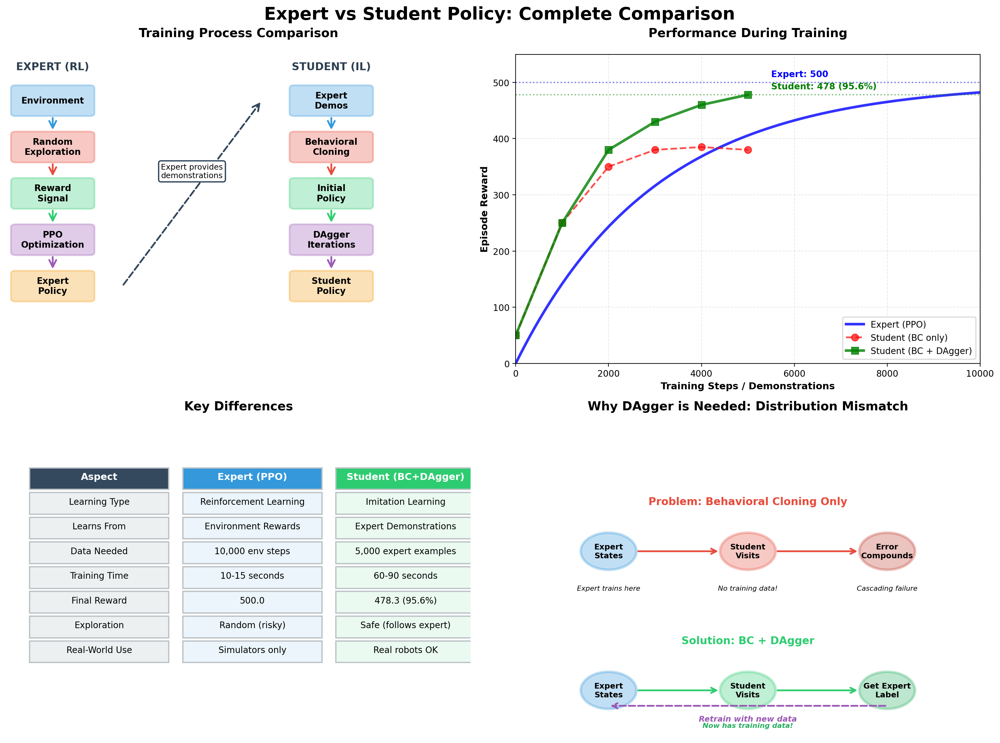
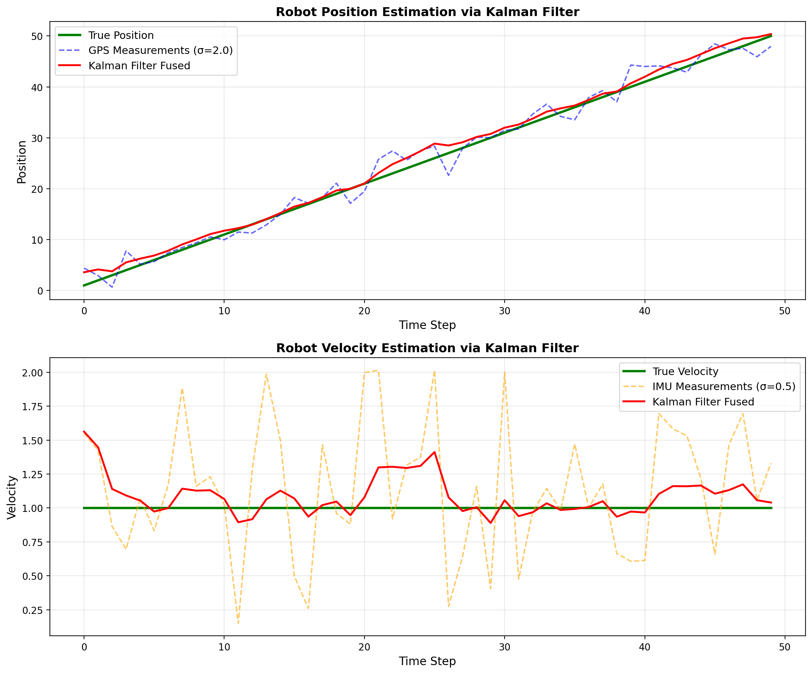
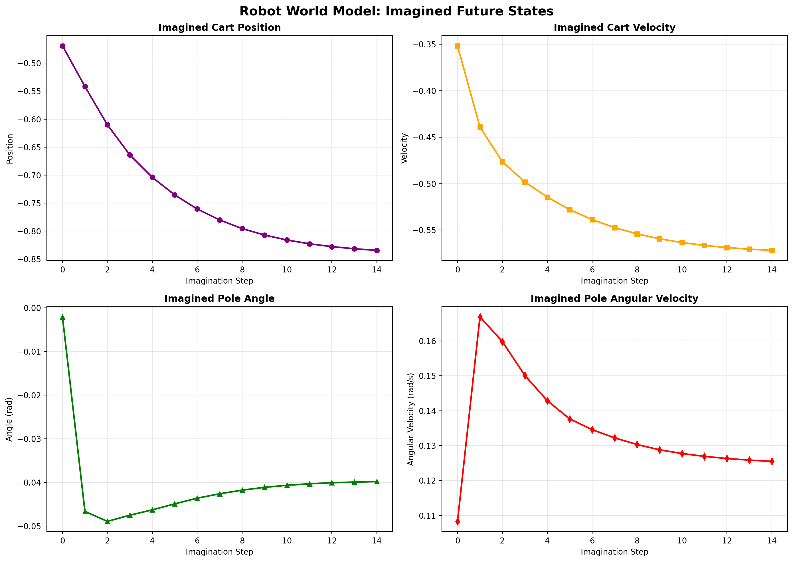

# Expert–Student Learning for CartPole using PPO and DAgger

## Overview
This project implements an **Expert–Student learning framework** for solving the **CartPole balancing problem** using a combination of **Reinforcement Learning (PPO)** and **Imitation Learning with DAgger**.

The entire project is implemented in a **single Jupyter Notebook**, making it easy to follow the full pipeline from training an expert agent to transferring knowledge to a student model.

In addition, the notebook includes experiments with **Flow Matching for robotic manipulators**, exploring modern generative modeling techniques for control.

---

## Contents (Single Notebook)
The notebook covers the following stages:

1. **Environment Setup**
   - CartPole environment (OpenAI Gym / Gymnasium)
   - Libraries and utilities

2. **Expert Training (PPO)**
   - Train an expert agent using Proximal Policy Optimization
   - Evaluate expert performance

3. **Student Training (Imitation Learning)**
   - Collect expert demonstrations
   - Train student via behavior cloning

4. **DAgger**
   - Student interacts with environment
   - Expert corrects student actions
   - Dataset aggregation and retraining

5. **Flow Matching Experiments**
   - Flow Matching applied to robotic manipulator control
   - Exploration of trajectory generation

---

## Key Concepts
- Reinforcement Learning (PPO)
- Imitation Learning
- DAgger (Dataset Aggregation)
- Expert–Student knowledge transfer
- Behavior Cloning
- Flow Matching for control systems

---

## Results
- The expert achieves stable CartPole balancing.
- The student successfully learns from expert demonstrations.
- DAgger significantly improves robustness over pure imitation learning.
- Flow Matching experiments provide insights into generative control models.

---

## What I Learned
- Practical understanding of modern RL and IL pipelines  
- How distribution shift affects imitation learning  
- How DAgger reduces compounding errors  
- Applying generative models (Flow Matching) to control  
- Building end-to-end learning systems in practice  
##Open the notebook and run all cells sequentially.

## Motivation

This project was built to deeply understand how intelligent systems learn from experts, adapt through interaction, and improve over time, with a focus on applications in AI and robotics.

## Future Work

Extend to continuous control environments (MuJoCo, Isaac Gym)

Apply DAgger to real robotic datasets

Combine Flow Matching with reinforcement learning

Multi-agent expert–student systems
---

## How to Run
```bash
pip install gymnasium stable-baselines3 torch numpy matplotlib
jupyter notebook
---

## Demo & Visual Results

### Expert vs Student Performance
Comparison of expert and student behavior during CartPole balancing.



---

### DAgger Training Rollouts
Short rollouts showing how the student improves over iterations.

#### Expert Policy
<video src="download (1).mp4" controls width="600"></video>

#### Student Policy (After DAgger)
<video src="download (2).mp4" controls width="600"></video>

---

### Additional Experiments

#### Sensor Fusion (Kalman Filter)
Visualization from sensor fusion experiments.



#### World Model & Imagination
World model visualization used for imagination-based planning.



